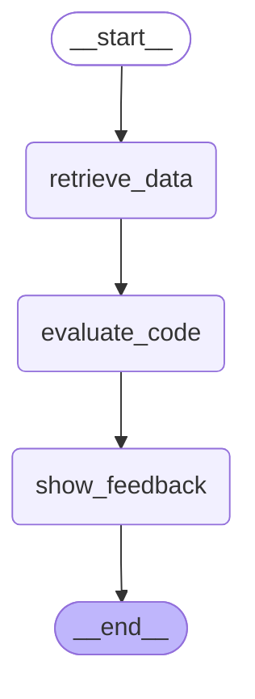

```mermaid
---
config:
  flowchart:
    curve: linear
---
graph TD;
	__start__([<p>__start__</p>]):::first
	retrieve_data(retrieve_data)
	evaluate_code(evaluate_code)
	show_feedback(show_feedback)
	__end__([<p>__end__</p>]):::last
	__start__ --> retrieve_data;
	evaluate_code --> show_feedback;
	retrieve_data --> evaluate_code;
	show_feedback --> __end__;
	classDef default fill:#f2f0ff,line-height:1.2
	classDef first fill-opacity:0
	classDef last fill:#bfb6fc

```